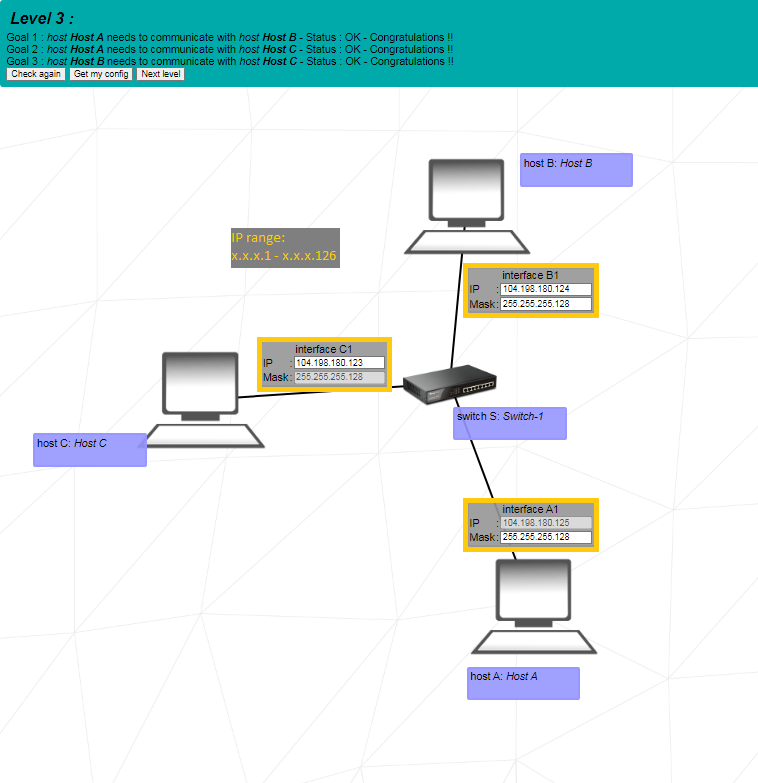

# 42_netpractice

------------------------------------------
calculating number of subnets and range of ip addresses from subnet mask
   
to calculate the number of subnets and range of ip addresses from subnet mask first you need to convert the first non-255 octet of the subnet mask to binary. so for 255.255.255.192 we look at the forth octet (192).
this can be done by repeatedly dividing by 2 and keeping track of the remainder as shown below.
converting 192 to binary:

|	| remainder |
|:----:|:----:|
| 192 ÷ 2 = 96 | 0 |
| 96 ÷ 2 = 48 | 0 |
| 48 ÷ 2 = 24 | 0 |
| 24 ÷ 2 = 12 | 0 |
| 12 ÷ 2 = 6 | 0 |
| 6 ÷ 2 = 3 | 0 |
| 3 ÷ 2 = 1 | 1 |
| 1 ÷ 2 = 0 | 1 |

the binary number is the remainders read in reverse order (from last to first).
so 192 in binary is 11000000.

this binary number is then used to calculate the number of subnets and range of ip addresses.
the formula to calculate the number of subnets is:

**Number of subnets = 2n**

where *n* is the number of bits used for subnetting (1s in non-255 octet of binary subnet mask).

the formula to calculate the number of ip addresses per subnet is:

**Number of ip addresses = 2m**

where *m* is the number of host bits (0s in entire binary subnet mask).

so for 255.255.255.192 (or in binary: 11111111.11111111.11111111.11000000)
the number of subnets would be 22 = 4 and the number of ip addresses per subnet would be 26 = 64.
the range of ip addresses for the 4 subnets would be:
- x.x.x.0 - x.x.x.63
- x.x.x.64 - x.x.x.127
- x.x.x.128 - x.x.x.191
- x.x.x.192 - x.x.x.255

the first and last addresses from each subnet are reserved for the network and broadcast addresses respectively.

slash notation is also based on the binary subnet masks.
it shows the number of bits in the ip address that represent the network address (1's at the start).

**decimal 255.255.255.192 = binary 11111111.11111111.11111111.11000000 = slash /26**

the same calculation can be done when there is less octets containing only network bits. **225.225.128.0** for example.
225.225.128.0 in binary is 11111111.11111111.10000000.00000000.
for this subnet mask we look at the third octet (128 or 10000000).
21 = 2 so there are 2 subnet masks and the number of ip addresses per subnet would be 215 = 32768.
with so many addresses per subnet we can't easily use that to work out the range of ip adresses per subnet like we could with 255.255.255.192.
instead if we divide 256 by the number of subnet masks we can apply that to the first non-255 octet to work out the ip ranges.
so for 225.225.128.0 (11111111.11111111.10000000.00000000) 256 / 2 = 128.
the ranges of ip addresses per subnet would be:
- x.x.0.0 - x.x.127.255
- x.x.128.0 - x.x.255.255

------------------------------------------
reserved ip address ranges

the following ip address ranges are reserved:
- 10.0.0.0 -> 10.255.255.255
- 172.16.0.0 -> 172.31.255.255
- 192.168.0.0 -> 192.168.255.255
- 127.0.0.0 -> 127.255.255.255
- 224.0.0.0 -> 239.255.255.255

------------------------------------------
## level 1

  
interface A1:

subnet mask is 255.255.255.0 so the first 3 bytes of the ip need to match interface B1's ip (104.98.23.12).
this means ip address can be any in the range 104.98.23.0 - 104.98.23.255 except the following 3:
- 104.98.23.0 - the first number represents the network and cannot be used by a host.
- 104.98.23.255 - the last number represents the broadcast address and cannot be used by a host.
- 104.98.23.12 - this ip address is already being used by interface B1.

interface D1:

subnet mask is 255.255.0.0 so the first 2 bytes of the ip need to match interface C1's ip (211.191.239.75).
this means ip address can be any in the range 211.191.0.0 - 211.191.255.255 except the following 3:
- 211.191.0.0 - represents the network.
- 211.191.255.255 - represents the broadcast address.
- 211.191.239.75 - this ip address is already being used by interface C1.

------------------------------------------
## level 2

  
interface A1:

subnet mask 255.255.255.224 = 11111111.11111111.11111111.11100000 = /27
using the formuli above we know that there are 8 subnets with 32 addresses each.
we can work out that the range of ip addresses for this subnet are **192.168.59.191 - 192.168.59.223**
the ip address for interface A1 can be any of the addresses in this range except for:
- 192.168.59.191 - host.
- 192.168.59.223 - broadcast.
- 192.168.59.222 - taken by interface B1.

interface B1:

the subnet mask must match that of interface A1 as there is no router.
- subnet mask should be **255.255.255.224 or /27**.

interface C1 & D1

subnet mask 255.255.255.252 = 11111111.11111111.11111111.11111100 = /30
this mask has 64 subnets with 4 addresses each.
again the first and last addesses of each subnet are the host and broadcast addresses.
this leaves the middle 2 host addresses per subnet.
the original ip addresses in these boxes seem like they would work but 127.0.0.0 adresses are reserved for loopback and IPC on the local host.

------------------------------------------
## level 3

  
interface A1:

the subnet mask for all interfaces need to match the given unchangable mask of interface C1.
- 255.255.255.128 or /25.

interface B1:

the subnet mask for all interfaces need to match the given unchangable mask of interface C1.
- 255.255.255.128 or /25.
the ip address range for based on the subnet mask and the given unchangable ip address at interface A1 is **104.198.180.0 - 104.198.180.127**.
the ip address for interface B1 must be:
- within that range.
- not the host or broadcast addresses.
- not the same as the addresses at A1 and C1.

interface C1:
the ip address range for based on the subnet mask and the given unchangable ip address at interface A1 is **104.198.180.0 - 104.198.180.127**.
the ip address for interface C1 must be:
- within that range.
- not the host or broadcast addresses.
- not the same as the addresses at A1 and B1.

------------------------------------------
## level 4

  
the subnet masks for interface A1, interface B1, & interface R1 must all be the same and must be able to support 3 host addresses.
the ip addresses for interface B1, & interface R1 must be in the same subnet range as the given A1 ip (122.130.111.132).

------------------------------------------
## level 5

  
interface A1:

the subnet mask for interface A1 must match that of interface R1 and the ip address must be in the same subnet ip range.
this ip range is 50.24.79.0 - 50.24.79.127 but the first and last addresses are reserved and 50.24.79.126 is already taken by interface R1.
- the possible acceptable host addresses for interface A1 are 50.24.79.1 - 50.24.79.125
- the subnet mask is 255.255.255.128

Host A Routes:

since there is only one route that host A can send it's packets the destination can be default.
the next hop is the ip address of the next router (or internet) interface to which the interface of the current machine must send its packets.
for host A the next router interface is interface R1.
- destination is 'default'
- next hop is 50.24.79.126

interface B1:

the subnet mask for interface B1 must match that of interface R2 and the ip address must be in the same subnet ip range.
this ip range is 134.118.128.0 - 134.118.255.255 but the first and last addresses are reserved and 134.118.218.254 is already taken by interface R2.
- the possible acceptable host addresses for interface A1 are 134.118.128.1 - 134.118.255.254 excluding 134.118.218.254
- the subnet mask is 255.255.192.0

Host B Routes:

as above with Host A the destination can be default and the next hop is the ip address of the next router interface.
- destination is 'default'
- next hop is 134.118.218.254

------------------------------------------
## level 6

  
interface A1:

subnet mask needs to match interface R1
- subnet mask is 255.255.255.128

Host A Routes:

destination should be default and next hop needs to be router interface R1's ip address.
setting the destination to default means that any packets that don't have a destination within the subnet will be passed to the next hop address which points to interface R1 of the router.
- destination is default (0.0.0.0/0)
- next hop is 91.84.197.254

interface R1:

the router interface R1 already has the subnet mask provided and locked in, the ip address needs to be in the same subnet as interface A1.
this ip range is 91.84.197.128 - 91.84.197.255 but the first and last addresses are reserved and 91.84.197.227 is already taken by interface A1.
- the possible acceptable host addresses for interface R1 are 91.84.197.129 - 91.84.197.254 excluding 91.84.197.227

Router R Routes:

destination for router R should be default which means if a packet is not destined for an address within the network, it will send it to the next hop address which points to the internet.
- destination is default (0.0.0.0/0)

Internet I Routes:

the destination for internet I should point to the network address of the subnet that interface A1 is on, combined with the CDIR of the network.
/25 indicates that the first 25 bits of the network address represent the network.
adding the CDIR (/25) to the network address informs the internet route that any packets addressed to ip addresses within the range of 91.84.197.128 - 91.84.197.255 should use the next hop address.
- destination is 91.84.197.128/25

------------------------------------------
## level 7

  
for level 7 we need to establish 3 separate networks, host A - router R1, router R1 - router R2, router R2 - host C.
to do this we need to use a subnet mask that can create at least 3 subnets which means /26 (255.255.255.192) or higher.
- I set the subnet mask to 255.255.255.192 for all interfaces.

interface A1:

the ip address needs to be in the same subnet as interface R11, since R11's ip has been given the subnet for this pair has already been decided.
the range of ip addresses for this subnet are 92.198.14.0 - 92.198.14.63 but the first and last addresses are reserved and 92.198.14.1 is already taken by interface R11.
- the possible acceptable host addresses for interface A1 are 92.198.14.2 - 92.198.14.62

Host A Routes:

destination should be default and next hop needs to be router interface R11's ip address.
- destination is default (0.0.0.0/0)
- next hop is 92.198.14.1

interface R11 & R12:

the ip addresses for both these interfaces are given and locked so we just need to change the subnet mask to 255.255.255.192

Router R1 Routes:

destination should be default and next hop needs to be router R2 interface R21's ip address.
- destination is default (0.0.0.0/0)
- next hop is 92.198.14.253

interface R21:

the ip address needs to be in the same subnet as interface R12, since R12's ip has been given the subnet for this pair has already been decided.
the range of ip addresses for this subnet are 92.198.14.192 - 92.198.14.255 but the first and last addresses are reserved and 92.198.14.254 is already taken by interface R12.
- the possible acceptable host addresses for interface A1 are 92.198.14.193 - 92.198.14.253

------------------------------------------
## level 8

  
Internet I Routes:

the destination is already given so we just need to set the next hop to the ip address of interface R12.
- next hop is 163.9.250.12

interface R13:

the ip address for interface R13 is given to us as the next hop for router R2.
for the subnet mask it needs to be /26 (255.255.255.192) or higher since we need 3 sub nets.
I used 255.255.255.240 (/28) out of convenience since it is already given to us elsewhere and it has enough subnets to cover the networks that we need.
- ip address is 147.64.136.62
- subnet mask is 255.255.255.240 (/28)

interface R21:

the ip address for interface R21 needs to be in the same subnet as R13 this means it needs to be in the range 147.64.136.48 - 147.64.136.63 but the first and last addresses are reserved and 147.64.136.62 is already taken by interface R13.
the subnet mask needs to match R13.
- ip address is 147.64.136.61
- subnet mask is 255.255.255.240 (/28)

Router R1 Routes:

the default destination is given and points to the internet.
we need to set the other destination to the network address of the hosts and next hop needs to be router R2 interface R21's ip address.
- destination is 147.64.136.0/26
- next hop is 147.64.136.61

Router R2 Routes:

destination should be default and next hop needs to be router R1 interface R13's ip address this was already given though.
- destination is default (0.0.0.0/0)
- next hop is 147.64.136.62

interfaces R22 & C1:

for ease I continued setting the subnet mask to 255.255.255.240 (/28)
the range for ip addresses I chose is 147.64.136.0 - 147.64.136.15 but it could be any /28 subnet that isn't already taken.
interface C1:
- ip address is 147.64.136.18
- subnet mask is 255.255.255.240 (/28)
interface R22:
- ip address is 147.64.136.17
- subnet mask is 255.255.255.240 (/28)

Host C Routes:

destination should be default and next hop needs to be router R2 interface R22's ip address.
- destination is default (0.0.0.0/0)
- next hop is 147.64.136.17

interfaces R23 & D1:

the subnet mask is given to us
the range for ip addresses I chose is 147.64.136.16 - 147.64.136.31 but it could be any /28 subnet that isn't already taken.
interface D1:
- ip address is 147.64.136.2
- subnet mask is 255.255.255.240 (/28)
interface R23:
- ip address is 147.64.136.1
- subnet mask is 255.255.255.240 (/28)

Host D Routes:

destination should be default and next hop needs to be router R2 interface R23's ip address.
- destination is default (0.0.0.0/0)
- next hop is 147.64.136.1

------------------------------------------
## level 9

  
for this level we have 3 seperate networks that we need to organise and then we can connect them all together.
the individual networks are:
- group AB - interface A1, interface B1, & interface R11
- group C - interface C1, & interface R22
- group D - interface D1, & interface R23
I usually start with the third group as interface R23 already has all of it's information provided.

**when setting up ip addresses make sure you are not using reserved addresses like 10.0.0.0 -> 10.255.255.255 & 192.168.0.0 -> 192.168.255.255**

group D:

interface R23:

the subnet mask is already locked and the ip address is provided by Host D Routes.
- ip address is 86.127.97.110
- subnet mask is /18 (255.255.192.0)

interface D1:

the subnet mask needs to match interface R23, and the ip can be any of a huge range from 86.127.64.0 - 86.127.127.255.
I just chose the ip address next to interface R23's ip.
- ip address is 86.127.97.111
- subnet mask is /18 (255.255.192.0)

Host D Routes:

destination should be default and next hop is already provided
- destination is default (0.0.0.0/0)
- next hop is 86.127.97.110

group C:

the subnet mask for this group can be whatever, I used 255.255.255.252 (/30) because I only need 2 host addresses.
the ip addresses can also be what ever as long as they are in the same subnet and are not reserved addresses.

interface R22:
- ip address is 14.14.14.1
- subnet mask is 255.255.255.252 (/30)

interface C1:
- ip address is 14.14.14.2
- subnet mask is 255.255.255.252 (/30)

Host C Routes:

destination should be default and next hop should be the ip address of interface R22
- destination is default (0.0.0.0/0)
- next hop is 14.14.14.1

group AB:

the subnet mask is provided for interface R11 so the others in this group need to match that.
the ip addresses can be what ever as long as they are in the same subnet and are not reserved addresses.

interface R11:
- ip address is 42.42.42.1
- subnet mask is 255.255.255.128 (/25)

interface A1:
- ip address is 42.42.42.2
- subnet mask is 255.255.255.128 (/25)

interface B1:
- ip address is 42.42.42.3
- subnet mask is 255.255.255.128 (/25)

Host A Routes:

destination should be default and next hop should be the ip address of interface R11.
- destination is default (0.0.0.0/0)
- next hop is 42.42.42.1

Host B Routes:

destination should be default and next hop should be the ip address of interface R11.
- destination is default (0.0.0.0/0)
- next hop is 42.42.42.1

  
after sorting out those 3 individual groups we need to connect the 2 routers and make sure that host A (meson) & host C (cation) can connect to the internet.

routers:

the subnet mask is already provided for interface R21 so we just need to make sure that interface R21 and interface R13 have the same subnet mask and are on the same subnet.

interface R21:
- ip address is 112.106.18.253
- subnet mask is 255.255.255.252 (/30) (provided)

interface R13:
- ip address is 112.106.18.254
- subnet mask is 255.255.255.252 (/30) (provided)

router R2 Routes:

router R2 needs interface R13 of router R1 as the next hop address.
- destination is default (0.0.0.0/0)
- next hop is 112.106.18.254

router R1 Routes:

router R1 has 3 routes.
the default route is already given to us and points to the internet.
we need 2 more routes that both point to interface R21 of router R2, 1 for packets with a destination of host C, and 1 for packets with a destination of host D.
- destination 1 is 14.14.14.2/24
- next hop 1 is 112.106.18.253
- destination 2 is 86.127.97.111/18
- next hop 2 is 112.106.18.253
- destination 3 is default (0.0.0.0/0) (provided)
- next hop 3 is 163.172.250.1 (provided)

internet:

internet I Routes:

we need the internet to be able to return packets to host A and host C so we need to specify their network addresses in the routing table.
- destination 1 is 42.42.42.1/24
- next hop 1 is 163.172.250.12 (provided)
- destination 2 is 14.14.14.2/24
- next hop 2 is 163.172.250.12 (provided)
- destination 3 is default (0.0.0.0/0)
- next hop 3 is 163.172.250.12 (provided)

------------------------------------------
## level 10

  
for this level the structure is pretty much the same as level 9 in that we have 3 individual groups to work on first and then connect them all together. the challenge with this one though is that we only have one destination on the internet's routing table which means that we are limited in what subnets we can use.

group H1/H2:

the subnet mask and ip range for this group are already provided at interface R11.

interface H11:
- ip address is 147.65.114.2 (provided)
- subnet mask is 255.255.255.128 (/25)

interface H21:
- ip address is 147.65.114.3
- subnet mask is 255.255.255.128 (/25)

because this group is using 255.255.255.128 (/25) as a subnet mask, the ip range 147.65.114.0 - 147.65.114.127 cannot be used by any of the other groups.

group H4:

the ip and subnet mask for interface R23 is already given to us in interface H41 and host H4 routes.

interface R23:
- ip address is 147.65.114.129
- subnet mask is 255.255.255.192 (/26)

this group uses the ip address range 147.65.114.128 - 147.65.114.191 so those addresses can't be used by other groups.

group H3:

we are starting to run low on ip addresses.
the ranges that have already been taken are:
- 147.65.114.0 - 147.65.114.127 group H1/H2
- 147.65.114.128 - 147.65.114.191 group H4
- 147.65.114.253 - 147.65.114.254 interface R13/R21

luckily we only need 2 addresses for this group so we can use 255.255.255.252 (/30) as a subnet mask and chose 2 of the remaining addresses.

interface R22:
- ip address is 147.65.114.250
- subnet mask is 255.255.255.252 (/30)

interface H31:
- ip address is 147.65.114.249
- subnet mask is 255.255.255.252 (/30)

Host H3 Routes:
- destination is default (0.0.0.0/0) (provided)
- next hop is 147.65.114.250 (interface R22 address)

  
lastly we just need to match the subnet address at interface R13 and fix the routing tables for the internet and router R1.

interface R13:
- subnet mask is 255.255.255.252 (/30)

internet I Routes:
- destination is 147.65.114.0/24

router R1 Routes:
- destination is 147.65.114.0/24
